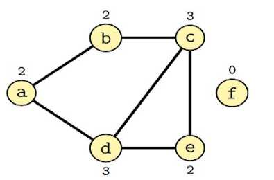
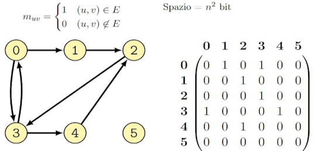
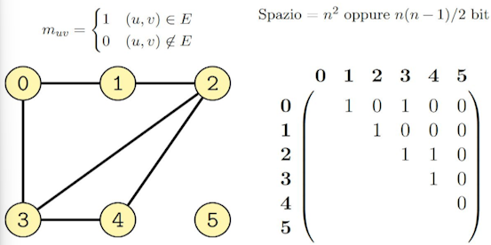
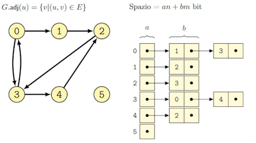
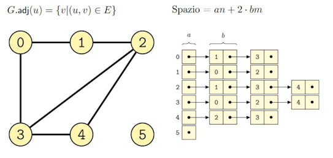

## Definizioni

### Grafo orientato

Un grafo orientato (directed) è una coppia $G = (V, E)$ dove $V$ è un insieme di nodi (node) o vertici (vertex) ed $E$ è un insieme di coppie ordinate $(u, v)$ di nodi dette archi (edge).

$V = \{a, b, c, d, e, f\}$ 
$E = \{(a, b), (a, d), (b, c), (d, a), (d, c), (d, e), (e, c)\}$

### Grafo non orientato

Un grafo non orientato (undirected) è una coppia $G = (V, E)$ dove $V$ è un insieme di nodi o vertici ed $E$ è un insieme di coppie non ordinate $(u,v)$ di nodi dette archi.

$V = \{a, b, c, d, e, f\}$ 
$E = \{(a, b), (a, d), (b, c), (c, d), (d, e), (c, e)\}$

## Terminologia

- Un vertice $v$ è detto **adiacente** a $u$ se esiste un arco $(u, v)$;
- Un arco $(u, v)$ è detto **incidente** da $u$ a $v$;
- In un grafo non orientato, la relazione di adiacenza è **simmetrica**;
- $(a, b)$ è incidente da $a$ a $b$;
- $(a, d)$ è incidente da $a$ a $d$;
- $(d, a)$ è incidente da $d$ ad $a$;
- $b$ e $d$ sono adiacenti ad $a$.

Un grafo con un arco fra tutte le coppie di nodi è detto **completo**; informalmente si dice **sparso** se ha pochi archi o **denso** se ne ha tanti.

Nei grafi non orientati il **grado** (degree) di un nodo è il numero di archi incidenti su di esso.

Nei grafi orientati distinguiamo il **grado entrante** (in-degree), ossia gli archi incidenti su un nodo, e il **grado uscente** (out-degree), ossia gli archi incidenti da un nodo.

## Dimensioni del grafo

- Numero di nodi: $n = |V|$;
- Numero di archi: $m = |E|$.

La complessità degli algoritmi sui grafi è espressa sia in termini di $n$ sia di $m$, ad esempio $O(n+m)$.

## Cammino (path)

In un grafo $G = (V, E)$, un cammino $C$ di lunghezza $k$ è una **sequenza di nodi** $u_0$, $u_1$ , …, $u_k$ tale che $(u_i, u_i+1) ∈ E$ per $0 ≤ i ≤ k−1$. Un cammino è detto **semplice** se tutti i suoi nodi sono **distinti**.

>[!Esempio]
>${a, b, c, e, d}$ è un cammino semplice nel grafo di lunghezza 4.
>

## Memorizzazione dei grafi

### Matrici di adiacenza

#### Grafi orientati

#### Grafi non orientati

### Liste di adiacenza

#### Grafi orientati

#### Grafi non orientati

## Iterazione sui grafi

#### Iterazione su tutti i nodi del grafo

Il costo computazionale è $O(n)$ per iterare sui nodi, ma il costo effettivo dipende anche dall’operazione che eseguiamo su ogni nodo (se anche quella è $O(n)$, complessivamente è $O(n^2)$).

#### Iterazione su tutti i nodi e archi del grafo

Il costo computazionale è $O(m+n)$ con le liste di adiacenza (ci sono $m$ archi e la lista di $u$ contiene solo gli archi che partono da $u$), $O(n^2)$ con le matrici di adiacenza.
